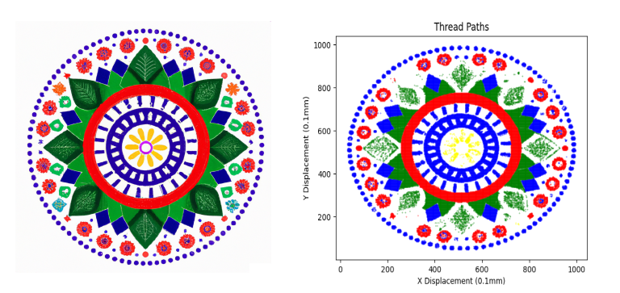
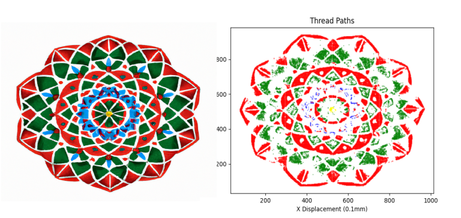

# PyStitchIt
PyStitchIt is a Python-based software to generate Janome Embroidery File format (JEF) to stitch a user-specified image on a fabric. The software supports 5 colors: Red, Green, Blue, Yellow and Black. A user specified text can also be added at the bottom of the pattern !

## How does it work ?

The software reads the RGB channels of each pixel of an image and classifies them as Red, Green Blue and Yellow or Black. Once the pixel are be classified, the thread paths can be generated.

## Features
1. Supports for 5 thread colors: Red, Yellow, Green, Blue and Black
2. User defined text

## Results

Rangoli is a beautiful art form from India. I utilized OpenAI's DALL-E to generate Rangoli patterns. For these pictures, I have used "Piyush" as user-defined text. 

## Generate thread paths

Run `stitchit.py`. Specify the image filename (with path) and then user specific text. Based on the image and text, a .jef file will be generated. 

 
 

